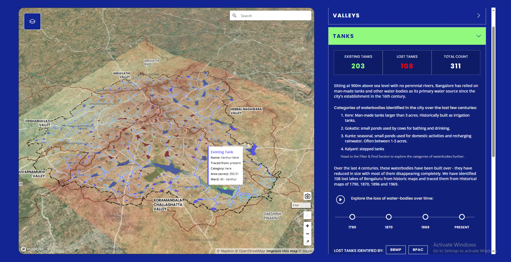

# Decoding Stormwater Infrastructure

**Building a Resilient Bengaluru** — Stormwater & the City Dashboard  
Live: [mod-foundation.github.io](https://mod-foundation.github.io)  
Campaign site: [buildingaresilientbengaluru.com](https://buildingaresilientbengaluru.com)

---

<div align="center">
  
</div>

## About

*Stormwater & the City* is a 12-month initiative by the Mod Foundation to develop an interactive digital dashboard that maps Bengaluru's stormwater drainage network (Rajakaluves) across physical, urban, and governance dimensions. Funded by the Bengaluru Sustainability Forum's Small Grants Programme, in collaboration with the Oorvani Foundation.

The dashboard makes Bengaluru's stormwater systems visible and legible through participatory tools, citizen-led audit data, and open datasets — positioning information as the first step toward action.

---

## Modules

| Module | Path | Description |
|--------|------|-------------|
| **Interactive Map** | `ecology_map/` | Watershed and ecology map. Covers regional to city-level drainage typologies, tank history, and valley systems. Built with MapLibre GL JS. |
| **Story Map** | `story_map/` | Immersive narrative map. Explores the history of Bengaluru's tanks and urbanisation through a timeline with georeferenced historical maps. |
| **Audit Dashboard** | `audit_dashboard/` | Citizen audit data dashboard. Displays geolocated audit points from Form 1/2/3 CSV data with photos, attribute charts, map filters, and keyboard/button point navigation ordered by `order` field. |
| **Audit Status** | `audit_status/` | Tracks the completion status of the field audit across drain segments and teams. |
| **Download Center** | `download_center/` | Central repository for downloading datasets (GeoJSON, CSV, DEM) used across the project. |

---

## Tech Stack

| Layer | Library / Tool |
|-------|---------------|
| Maps | [MapLibre GL JS](https://maplibre.org/) v4.7 |
| Basemaps | Mapbox Satellite, CartoCDN, OSM via MapLibre |
| Charts | [Chart.js](https://www.chartjs.org/) v4 |
| CSV parsing | [PapaParse](https://www.papaparse.com/) v5.4 |
| UI components | [Web Awesome](https://www.webawesome.com/) (wa-button, wa-select, wa-icon, wa-dialog, wa-details) |
| UI components (home) | [Shoelace](https://shoelace.style/) v2.15 |
| Fonts | [Barlow](https://fonts.google.com/specimen/Barlow) — Google Fonts |
| Hosting | GitHub Pages |
| Editor | VS Code with Claude Code integration |

---

## Data

Audit field data is collected via KoboToolbox (Forms 1, 2, 3) and stored as CSV in `audit_dashboard/data/csv/`. Spatial datasets (drain networks, valley boundaries, corporation boundaries, historical maps) are stored in `download_center/data/` as GeoJSON and GeoTIFF.

See the [datasets README](https://github.com/mod-foundation/mod-foundation.github.io/blob/main/download_center/README.md#datasets-and-sources) for sources and access.

---

## Deployment

The repository is served directly via **GitHub Pages** from the `main` branch. There is no build step — all modules are plain HTML/CSS/JS.

```
https://mod-foundation.github.io/          → index.html (home)
https://mod-foundation.github.io/ecology_map/
https://mod-foundation.github.io/story_map/
https://mod-foundation.github.io/audit_dashboard/
https://mod-foundation.github.io/audit_status/
https://mod-foundation.github.io/download_center/
```

---

## Acknowledgments

Led by the **Mod Foundation**, in partnership with the **Oorvani Foundation**, Citizen Matters, and OpenCity. Supported by the **Bengaluru Sustainability Forum's Small Grants Programme**.
